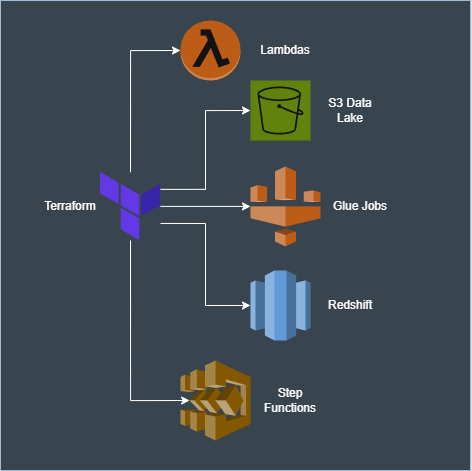
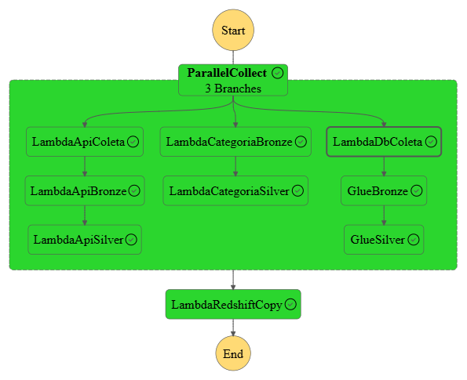

# Desafio BIX - Pipeline de Dados com AWS

Este projeto implementa um pipeline de dados utilizando serviços da AWS como Glue, Lambda, Redshift Serverless, S3 e Step Functions. O objetivo é construir uma arquitetura robusta e modular para ingestão, processamento, e carga de dados em um data warehouse, com foco em boas práticas de engenharia de dados.

## 📐 Arquitetura

- **Camada de ingestão**: Dados coletados via API, via DB Postgres e em formato Parquet (esses são colocados manualmente no S3).
- **Camada Bronze/Silver**: Lambdas e Glue Jobs organizam e transformam os dados conforme a arquitetura Medallion.
- **Persistência final**: Dados transformados são copiados para o Redshift Serverless.
- **Orquestração**: Toda a cadeia é executada por uma Step Function AWS.

## 🗺️ Diagramas da Arquitetura

Abaixo estão dois diagramas que ilustram a arquitetura da solução:

### 🔹 Visão Geral da Arquitetura via Terraform



### 🔹 Detalhamento da Pipeline



## 🧰 Tecnologias e Componentes

- AWS Lambda (dividida em funções para API, bronze, silver, copy, etc.)
- AWS Glue (jobs de transformação em PySpark)
- Amazon Redshift Serverless
- Amazon S3
- AWS Step Functions
- AWS CLI + Terraform
- Python, PySpark, Pandas
- Camada pública para dependências (`pandas`, `pyarrow`)
- Camada psycopg2 para conexão com banco e coleta dos dados

## 📁 Estrutura

```
glue_jobs/              # Scripts PySpark para camada Bronze e Silver
lambda/                 # Código das Lambdas organizadas por função
layers/                 # Dependências empacotadas como Lambda Layer
utils/                  # Scripts de build e automação (ex: subir Glue Jobs)
terraform/              # Infraestrutura como código
```

## ✅ Pré-requisitos

- AWS CLI configurada e autenticada (`aws configure`)
- Python 3.10+
- Terraform instalado (para provisionamento de infraestrutura)
- Permissões adequadas para criar recursos (S3, IAM, Redshift, Glue, Lambda, etc.)

## 🚀 Como Executar

### 1. Build das Lambdas

Execute o script de build localizado em `utils/build_all.py` para empacotar todas as funções Lambda com suas dependências:

```bash
cd utils/
python build_all.py
```

### 2. Suba a infraestrutura

```bash
terraform init
terraform apply
```

### 3. Faça upload manual do dataset fornecido

Coloque o arquivo `categoria.parquet` fornecido no desafio em:

```
s3://<bucket>/raw/{data}/categoria.parquet
```

### 4. Suba os Glue Jobs

```bash
cd utils/
./upload_glue_jobs.sh  # ou execute os scripts individuais de build
```

### 5. Configure permissão manual no Redshift

No Console da AWS → Redshift Serverless:

- Vá em **Workgroup** > **Permissions**
- Adicione a IAM Role usada pelas funções de COPY
- Marque a opção de acesso ao Redshift e ao S3

### 6. Recupere as credenciais do superusuário e crie as tabelas

- Acesse o **AWS Secrets Manager** e copie o usuário e senha do segredo do Redshift (`admin_bix` ou equivalente).
- Use essas credenciais para se conectar ao Query Editor v2.
- Execute os arquivos SQL de criação de schema e tabelas que estão na pasta `utils/`:
  - `utils/redshift_tables.sql`

### 7. Execute a Lambda `lambda_db`

Essa Lambda executa os comandos SQL (como `TRUNCATE` e `COPY`) no Redshift. Para isso:

- A lambda irá executar um `SELECT 1` e irá falhar, porém irá criar o usuário associado a role.
- Execute via Query Editor v2:

```sql
GRANT USAGE ON SCHEMA silver TO "IAMR:lambda-redshift-exec-role";
GRANT ALL ON ALL TABLES IN SCHEMA silver TO "IAMR:lambda-redshift-exec-role";
```

### 8. Execute a Step Function

Após a infraestrutura e permissões configuradas, inicie o fluxo principal via AWS Step Functions.

---

## ⚠️ Observações Importantes

- ✅ **AWS CLI deve estar autenticada** com uma conta que tenha acesso completo aos serviços utilizados.
- 📁 O dataset `categoria.parquet` **precisa ser carregado manualmente** no S3 antes de iniciar o pipeline.
- 🧠 A permissão de `COPY` no Redshift **não é automática** e exige configuração no console.
- 🔐 O Redshift só reconhece a IAM Role como um usuário (`IAMR:...`) **após a primeira execução bem-sucedida** de uma Lambda com essa role.
- 🧱 Os Glue Jobs não são gerenciados diretamente pelo Terraform. Use os scripts de `utils/` para enviar os scripts `.py` para o S3.

---

## 👨‍💻 Autor

Desenvolvido por Pedro Sá para fins do desafio proposto.
